# Golang App - Fiber Framework

## Application - Task Management
- [x] Create Users
- [x] Upload User image
- [x] Add Tasks
- [ ] Upload Tasks from CSV File
- [x] Add Task Attachment
- [x] Search Users and Tasks
- [x] Reports (PDF)
- [x] Statistics (Count Records)
- [ ] Logs
- [x] Pagination

## Architecture
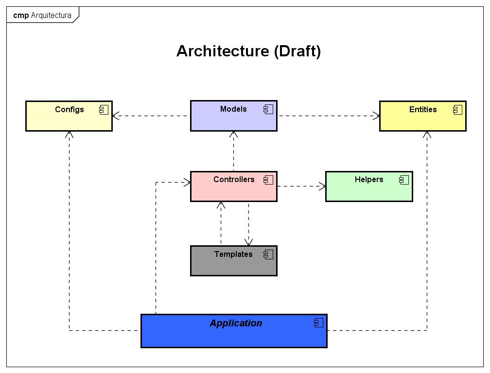

- Config
- Helpers: functions (Date, Strings, Conversions, Uploads, ...)
- Entities: Represents a table ina database
- Models: Represents the Business Logic
- Controllers: Represents all controllers or handlers
- Templates: All Html templates for rendering data
- Application: Main Layer that call all other layers

## Design
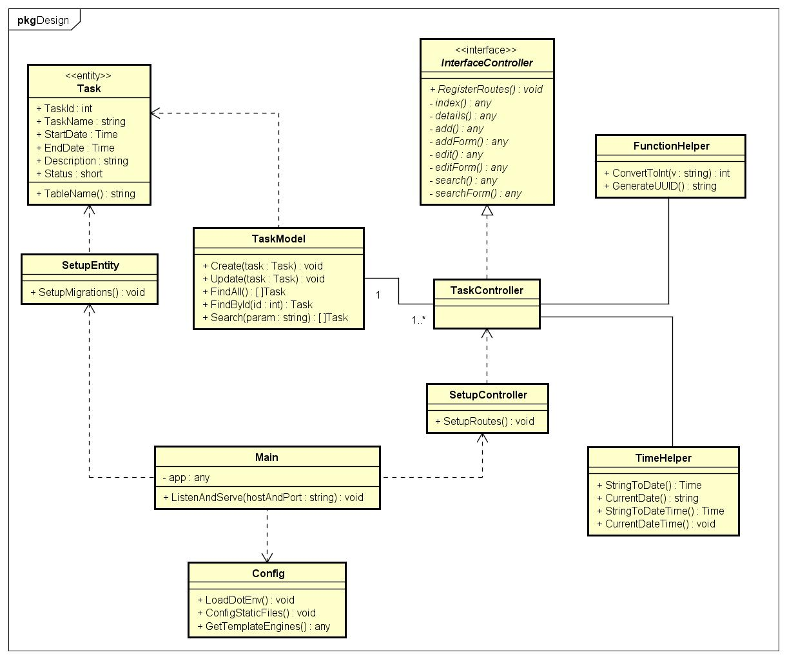

- Models: Operations: Create, Read, Find, ...
- Interface for Controllers
- SetupController: Load all routes
- Configs: Env, Logs, Template Engines
- Main: Loadd all components to run application
- App: Main class or file, that call all controllers, migrations, configs and template engines

## Libraries 
- [GORM](https://gorm.io)
- [Fiber Framework](https://github.com/gofiber/fiber)
- [go-wkhtmltopdf](https://github.com/SebastiaanKlippert/go-wkhtmltopdf) - For PDF Rendering

## Installation
- Copy database script to MySQL Server: [golang_fiber_mvc](database/golang_fiber_mvc.sql)
- Download [wkhtmltopdf](https://wkhtmltopdf.org/downloads.html)
- Install *wkhtmltopdf* and add to environment variables
- clone git repository: ``git clone https://github.com/ortizdavid/go-htmppdf-example``
- Install dependencies: ``go mod install``
- Create Admin User: ``go run create_user.go``
- Run application: ``go run main.go``

## Application Screens

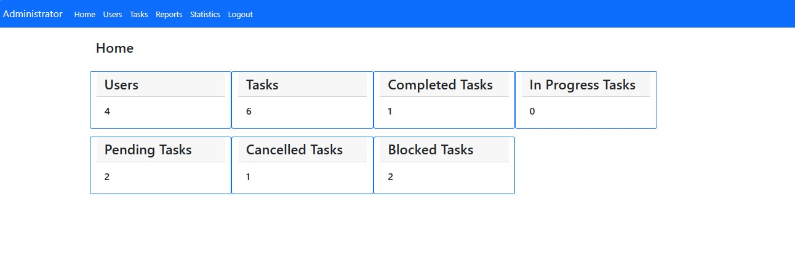

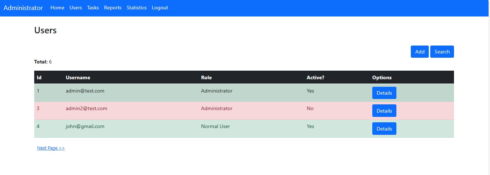

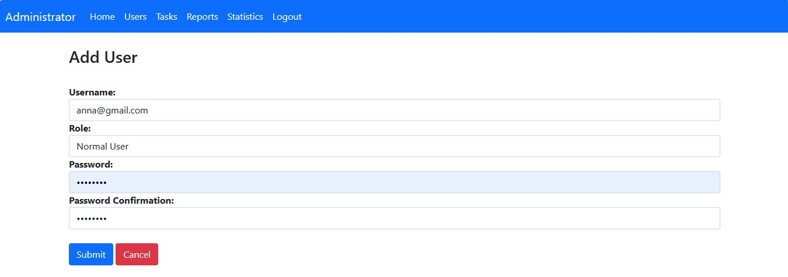

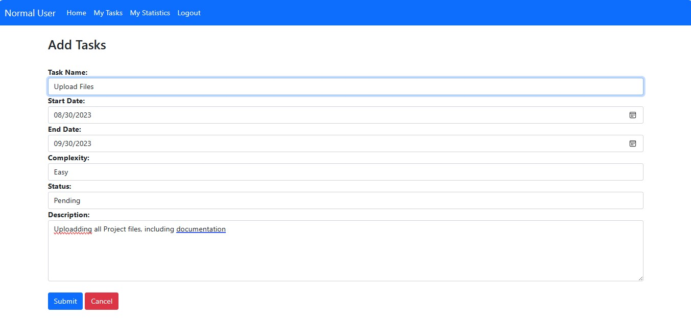

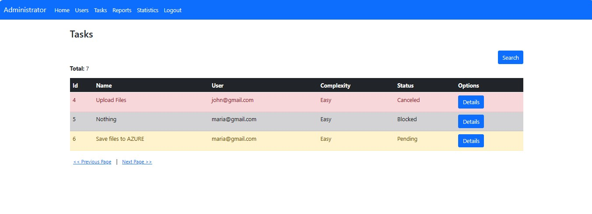

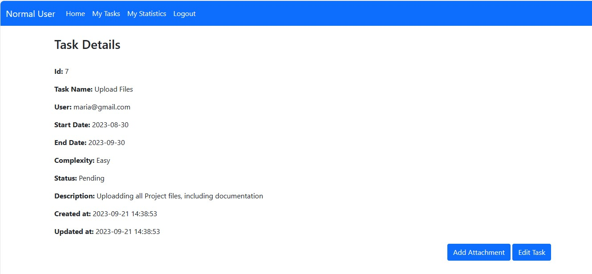

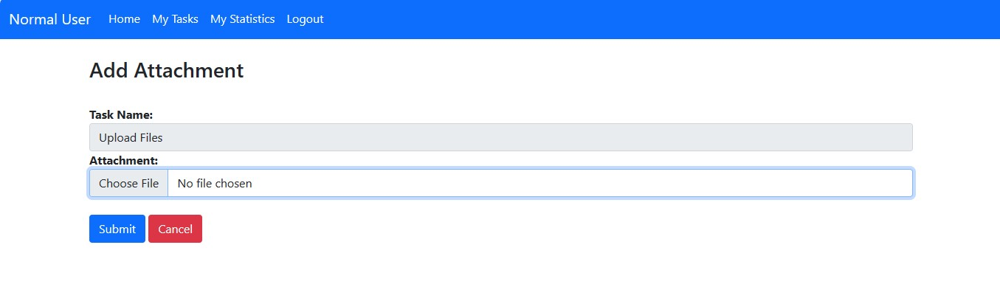

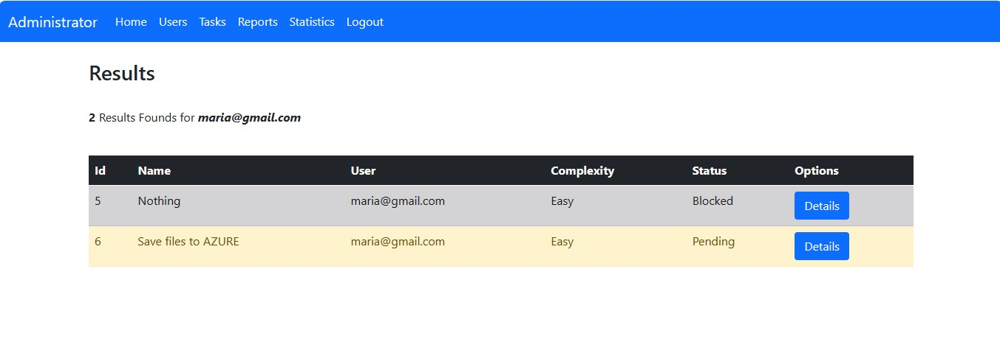

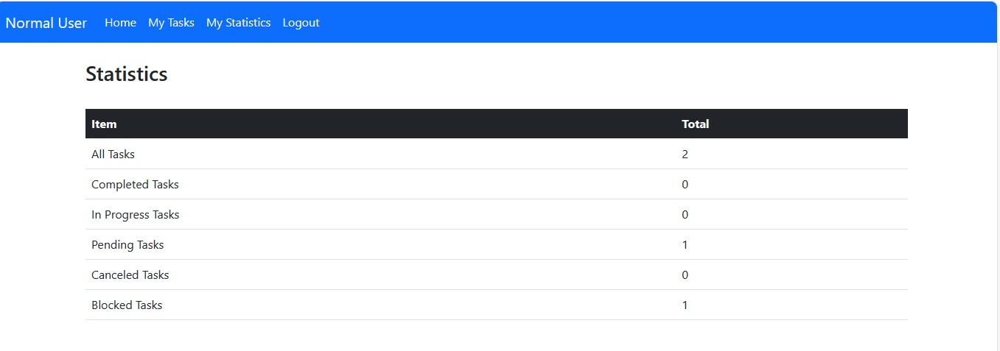

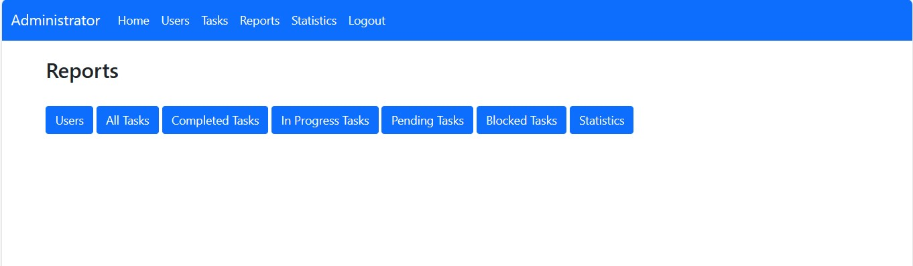

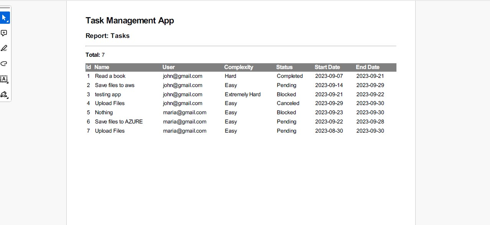